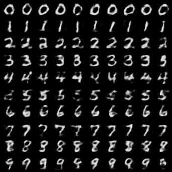
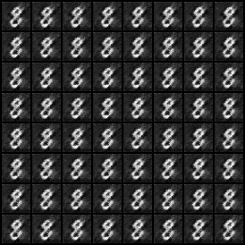
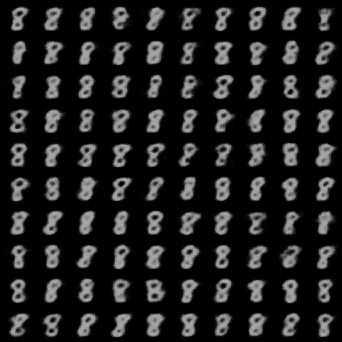
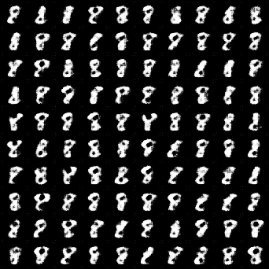
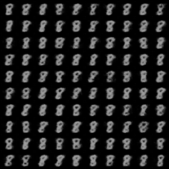
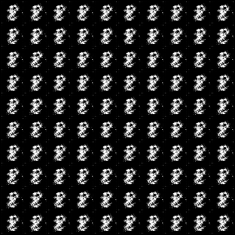

# 实验八：差分隐私生成模型

本项目完成实验八的必做任务，并在统一的 MNIST 数据、随机种子和评估流程下实现三组扩展实验：

1. **必做**：DP-SGD + DCGAN，训练并生成数字 8。
2. **改进 1**：DP-ACWGAN-CP，条件生成完整 MNIST 0–9。
3. **改进 2**：DP-CVAE，分别训练完整 MNIST 0–9 和单独数字 8。
4. **改进 3**：DP-WGAN-CP，只训练并生成数字 8。
5. **低预算实验**：在数字 8 上将 DP-CVAE 与 DP-WGAN-CP 的隐私预算限制为 ε<2。

仓库只归档每项实验最终采用的模型、样本、训练记录和评估结果；调参过程中产生的中间模型保留在本地 `runs/`，不上传 GitHub。

## 结论

### 完整 MNIST 0–9

| 模型 / 评估器 | 标签一致率 ↑ | 稳健覆盖 ↑ | 归一化熵 ↑ | 特征 FID ↓ | ε |
|---|---:|---:|---:|---:|---:|
| DP-CVAE / LeNet | 94.91% | 10/10 | 0.9988 | 499.45 | 7.9997 |
| DP-ACWGAN-CP / LeNet | **100.00%** | **10/10** | **1.0000** | **464.98** | 7.9950 |
| DP-CVAE / ConvNet | 94.51% | 10/10 | 0.9982 | **334.47** | 7.9997 |
| DP-ACWGAN-CP / ConvNet | **100.00%** | **10/10** | **1.0000** | 513.57 | 7.9950 |

DP-ACWGAN-CP 的类别控制最好，两套评估器均达到 100% 标签一致率。DP-CVAE 的 ConvNet 特征 FID 更低，但在 LeNet 特征空间中略高，因此不能宣称某个模型在所有图像质量指标上绝对占优。

### 单独数字 8

| 模型 / 评估器 | 数字 8 识别率 ↑ | 平均置信度 ↑ | 特征 FID ↓ | ε | 训练时间 |
|---|---:|---:|---:|---:|---:|
| 必做 DP-DCGAN / LeNet | **100.00%** | **99.98%** | 865.36 | **1.9324** | **45.59 s** |
| DP-CVAE / LeNet | 99.96% | 99.34% | 1124.84 | 7.9944 | 106.53 s |
| DP-WGAN-CP / LeNet | 97.04% | 97.70% | **309.06** | 7.9985 | 96.36 s |
| 必做 DP-DCGAN / ConvNet | **100.00%** | 99.84% | 637.83 | **1.9324** | **45.59 s** |
| DP-CVAE / ConvNet | **100.00%** | **99.88%** | 463.61 | 7.9944 | 106.53 s |
| DP-WGAN-CP / ConvNet | 98.30% | 97.52% | **140.15** | 7.9985 | 96.36 s |

结论如下：

- **生成分布质量最好**：DP-WGAN-CP。两套评估器的 FID 都最低，ConvNet FID 仅 140.15。
- **数字 8 识别最稳定**：DP-CVAE 与必做 DP-DCGAN，ConvNet 识别率均为 100%。
- **隐私更强且训练最少**：必做 DP-DCGAN，ε=1.9324，且只训练 10 轮。注意它和两个改进模型的隐私预算不同，FID 对比不属于完全相同隐私约束下的消融实验。

### 数字 8：ε<2 实验

两种模型均以目标 ε=1.9、δ=1e-5 重新训练，其余核心结构和训练轮数与 ε≈8 的版本保持一致。

| 模型 / 评估器 | 数字 8 识别率 ↑ | 平均置信度 ↑ | 特征 FID ↓ | 实际 ε | 噪声乘数 |
|---|---:|---:|---:|---:|---:|
| DP-CVAE / LeNet | 99.99% | 98.26% | 1539.17 | 1.8995 | 2.2559 |
| DP-WGAN-CP / LeNet | 100.00% | 100.00% | **690.92** | 1.8977 | 2.4902 |
| DP-CVAE / ConvNet | 100.00% | 99.89% | **599.53** | 1.8995 | 2.2559 |
| DP-WGAN-CP / ConvNet | 100.00% | 100.00% | 904.18 | 1.8977 | 2.4902 |

识别率在低预算下仍然接近 100%，但这不代表生成质量没有下降。DP-CVAE 的 ConvNet FID 由 463.61 上升到 599.53；DP-WGAN-CP 的 ConvNet FID 由 140.15 上升到 904.18，而且样本出现明显重复。说明 ε≈1.9 时的额外噪声显著削弱了 WGAN Critic 的有效训练信号。低预算 DP-CVAE 的视觉多样性和 ConvNet FID 更稳健；两种评估器对低预算模型的 FID 排序不同，因此报告同时保留两套结果。

完整机器可读对比见 `results/comparison.csv`。

## 目录结构

```text
differential-privacy-dcgan/
├── README.md
├── requirements.txt
├── scripts/
│   └── run_required.ps1
├── src/
│   ├── required/                 # 必做 DP-DCGAN
│   ├── improved/                 # 0-9 DP-ACWGAN-CP
│   └── additional/               # DP-CVAE、数字8 DP-WGAN-CP、统一评估器
└── results/
    ├── comparison.csv
    ├── required/                 # 必做数字8
    ├── improved/                 # DP-ACWGAN-CP 0-9
    ├── dp_vae_all/               # DP-CVAE 0-9
    ├── dp_vae_digit8/            # DP-CVAE 数字8，ε≈8
    ├── dp_wgan_cp_digit8/        # DP-WGAN-CP 数字8，ε≈8
    ├── dp_vae_digit8_eps1p9/     # DP-CVAE 数字8，ε<2
    └── dp_wgan_cp_digit8_eps1p9/ # DP-WGAN-CP 数字8，ε<2
```

每个新增实验目录包含：

- `model/`：最终发布模型；
- `sample/`：最终生成样本；
- `metrics/training_metrics.csv`：逐轮训练记录；
- `metrics/training_summary.json`：配置、隐私预算和最终训练指标；
- `metrics/evaluation_*.json`：LeNet 与 ConvNet 的正式评估；
- `metrics/class_histogram_*.csv`：预测类别分布；
- `logs/`：最终训练与评估的标准输出日志；动态进度条 stderr 原始文件仅保留在本地 `runs/`。

## 环境

本次正式运行环境：

- Python 3.10
- PyTorch 2.4.1 + CUDA 12.4
- torchvision 0.19.1
- Opacus 1.5.4
- NVIDIA GeForce RTX 4060 Laptop GPU 8GB

安装依赖：

```powershell
python -m pip install -r .\requirements.txt
```

以下命令均在项目根目录执行。数据默认下载到 `data/`，实验过程输出到被 Git 忽略的 `runs/`。

## 一、必做：DP-SGD + DCGAN（数字 8）

判别器接收真实数字 8 和生成图像。Opacus 对判别器的逐样本梯度裁剪后加入高斯噪声；生成器不直接读取私有数据，只通过私有判别器获得训练信号。

正式配置：10 epoch、batch size 64、噪声乘数 1.0、最大梯度范数 1.0、ε=1.93239、δ=1e-5。

```powershell
.\scripts\run_required.ps1
```

## 二、DP-ACWGAN-CP（MNIST 0–9）

该模型在 WGAN 权重裁剪基础上加入标签条件、投影判别器、辅助分类头和 EMA 生成器，以解决 0–9 条件生成中的类别模式坍缩。最终模型还使用独立公开分类器进行不访问私有训练样本的后处理，因此额外隐私成本为 0。

```powershell
.\.venv\Scripts\python.exe .\src\improved\train_dp_wgan.py `
  --data-root .\data --output-dir .\runs\improved `
  --epochs 40 --batch-size 128 --latent-size 128 `
  --generator-features 64 --critic-features 32 --critic-steps 3 `
  --generator-lr 1e-4 --critic-lr 1e-4 `
  --wasserstein-weight 0.01 `
  --critic-class-weight 1.0 --generator-class-weight 2.0 `
  --weight-clip 0.02 --max-grad-norm 1.0 `
  --target-epsilon 8 --delta 1e-5 --ema-decay 0.99 --device cuda
```

正式运行：40 epoch，ε=7.99499，训练 1112.29 秒。

## 三、DP-CVAE

### 算法原理

编码器学习近似后验 `q(z|x,y)`，通过重参数化得到潜变量，解码器学习 `p(x|z,y)`。本实现使用类别条件高斯先验，使不同标签在潜空间中具有可分离的中心。优化目标为：

```text
L = BCE(x_reconstructed, x) + beta * KL(q(z|x,y) || p(z|y))
```

Opacus 对编码器、解码器和标签条件参数统一执行 DP-SGD。训练采用 KL warm-up、EMA 和 ghost clipping；每轮原子写入恢复点，正常完成后只保留最终发布模型。

### 完整 0–9

```powershell
.\.venv\Scripts\python.exe .\src\additional\train_dp_vae.py `
  --data-root .\data --output-dir .\runs\dp_vae_all `
  --epochs 30 --batch-size 256 --grad-sample-mode ghost `
  --latent-size 64 --features 32 --prior-scale 10 `
  --learning-rate 0.001 --beta 0.05 --kl-warmup-epochs 8 `
  --ema-decay 0.99 --target-epsilon 8 --delta 1e-5 `
  --max-grad-norm 1 --seed 2026 --device cuda
```

正式运行：30 epoch，ε=7.99970，训练 987.70 秒。

### 单独数字 8

```powershell
.\.venv\Scripts\python.exe .\src\additional\train_dp_vae.py `
  --data-root .\data --output-dir .\runs\dp_vae_digit8 `
  --target-digit 8 --epochs 40 --batch-size 128 `
  --grad-sample-mode ghost --latent-size 64 --features 32 `
  --prior-scale 10 --learning-rate 0.001 --beta 0.05 `
  --kl-warmup-epochs 8 --ema-decay 0.99 `
  --target-epsilon 8 --delta 1e-5 --max-grad-norm 1 `
  --seed 2026 --device cuda
```

正式运行：40 epoch，ε=7.99443，训练 106.53 秒。

## 四、DP-WGAN-CP（数字 8）

Critic 使用 Wasserstein 距离替代二元交叉熵，并通过参数裁剪满足近似 Lipschitz 约束。DP-SGD 只作用于读取私有数字 8 的 Critic；生成器通过 Critic 的输出间接学习，因此隐私保证经后处理性质传递给生成器。

```powershell
.\.venv\Scripts\python.exe .\src\additional\train_dp_wgan_cp_digit8.py `
  --data-root .\data --output-dir .\runs\dp_wgan_cp_digit8 `
  --target-digit 8 --epochs 50 --batch-size 128 `
  --latent-size 128 --generator-features 64 --critic-features 32 `
  --generator-lr 0.0001 --critic-lr 0.00005 `
  --critic-steps 3 --weight-clip 0.02 --ema-decay 0.99 `
  --target-epsilon 8 --delta 1e-5 --max-grad-norm 1 `
  --seed 2026 --device cuda
```

正式运行：50 epoch，ε=7.99852，训练 96.36 秒。

## 五、ε<2 的数字 8 实验

低预算实验沿用上述命令，只需分别把输出目录改为新目录，并将 `--target-epsilon` 改为 `1.9`：

```powershell
# DP-CVAE
.\.venv\Scripts\python.exe .\src\additional\train_dp_vae.py `
  --data-root .\data --output-dir .\runs\dp_vae_digit8_eps1p9 `
  --target-digit 8 --epochs 40 --batch-size 128 `
  --grad-sample-mode ghost --latent-size 64 --features 32 `
  --prior-scale 10 --learning-rate 0.001 --beta 0.05 `
  --kl-warmup-epochs 8 --ema-decay 0.99 `
  --target-epsilon 1.9 --delta 1e-5 --max-grad-norm 1 `
  --seed 2026 --device cuda

# DP-WGAN-CP
.\.venv\Scripts\python.exe .\src\additional\train_dp_wgan_cp_digit8.py `
  --data-root .\data --output-dir .\runs\dp_wgan_cp_digit8_eps1p9 `
  --target-digit 8 --epochs 50 --batch-size 128 `
  --latent-size 128 --generator-features 64 --critic-features 32 `
  --generator-lr 0.0001 --critic-lr 0.00005 `
  --critic-steps 3 --weight-clip 0.02 --ema-decay 0.99 `
  --target-epsilon 1.9 --delta 1e-5 --max-grad-norm 1 `
  --seed 2026 --device cuda
```

正式运行结果：DP-CVAE 实际 ε=1.89950、训练 114.73 秒；DP-WGAN-CP 实际 ε=1.89772、训练 94.80 秒。

## 六、统一评估流程

正式评估均生成 10,000 张图像，随机种子为 2026，并分别使用 LeNet 与独立 ConvNet。0–9 模型的 FID 参考 10,000 张 MNIST 测试图；数字 8 模型参考测试集中全部 974 张数字 8。

以数字 8 的 DP-WGAN-CP 和 ConvNet 为例：

```powershell
.\.venv\Scripts\python.exe .\src\additional\evaluate_generator.py `
  --checkpoint .\results\dp_wgan_cp_digit8\model\dp_wgan_cp_digit8_final.pt `
  --model-type dp_wgan_cp --task single --target-digit 8 `
  --evaluator-checkpoint .\results\improved\evaluators\convnet_mnist_best.pt `
  --data-root .\data --output-dir .\runs\evaluation `
  --num-samples 10000 --num-real 10000 `
  --batch-size 256 --device cuda
```

### 指标说明

| 指标 | 含义 |
|---|---|
| 标签一致率 / 数字 8 识别率 | 生成标签与评估器预测一致的比例，越高越好 |
| 平均置信度 | 评估器对生成样本预测的平均最大概率，越高越好 |
| 稳健类别覆盖 | 生成占比至少 1% 的类别数量；仅适合 0–9 条件生成 |
| 归一化类别熵 | 预测类别分布的均衡程度；仅适合 0–9 条件生成 |
| 特征 FID | 评估器特征空间中的生成分布与真实分布距离，越低越好 |
| ε、δ | 差分隐私预算；在相同 δ 下，ε 越小隐私越强 |

FID 只能在相同任务、相同评估器、相同预处理和样本数量下比较。LeNet FID 与 ConvNet FID 使用不同特征空间，不能直接互相比较。

## 最终样本

DP-CVAE（0–9）：



必做 DP-DCGAN（数字 8）：



DP-CVAE（数字 8）：



DP-WGAN-CP（数字 8）：



DP-CVAE（数字 8，ε<2）：



DP-WGAN-CP（数字 8，ε<2）：


