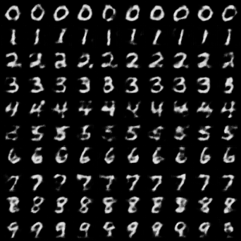
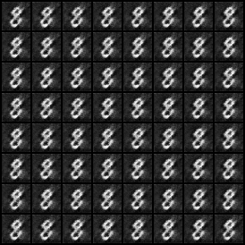
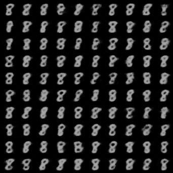
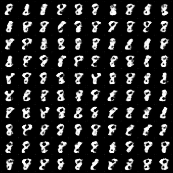
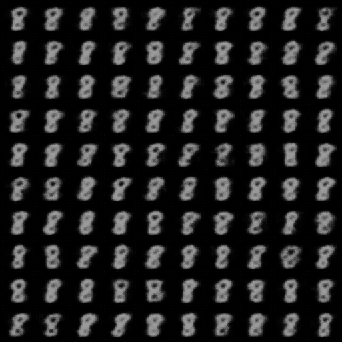
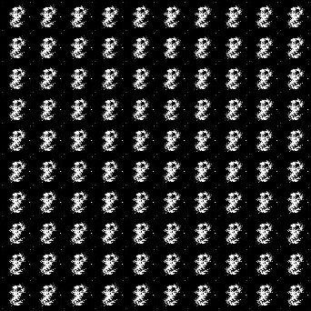

# 实验八：差分隐私生成模型

[](https://colab.research.google.com/github/Tomatoisawful/differential-privacy-dcgan/blob/main/notebooks/colab_retrain.ipynb)

实验报告：[Word 版](docs/实验八差分隐私生成模型实验报告.docx)｜[PDF 版](docs/实验八差分隐私生成模型实验报告.pdf)

本项目完成实验八的必做任务，并在统一的 MNIST 数据、随机种子和评估流程下实现三组扩展实验：

1. **必做**：DP-SGD + DCGAN，训练并生成数字 8。
2. **改进 1**：DP-ACWGAN-CP，条件生成完整 MNIST 0–9。
3. **改进 2**：DP-CVAE，分别训练完整 MNIST 0–9 和单独数字 8。
4. **改进 3**：DP-WGAN-CP，只训练并生成数字 8。
5. **其他对比实验**：在数字 8 上将 DP-CVAE 与 DP-WGAN-CP 的隐私预算限制为 ε<2。

## 总体结论

本项目先完成课程要求的 DP-SGD 与 DCGAN 数字 8 生成任务，再实现 DP-CVAE、DP-WGAN-CP 和 DP-ACWGAN-CP。随后在 Google Colab 中把所有配置统一训练到 100 轮，用同一组 LeNet、ConvNet、样本数量和随机种子重新评估。结果表明，固定隐私预算下增加训练轮数并不一定改善生成质量：数字 8 的 DP-DCGAN 与 DP-CVAE 明显受益，而完整 0–9 模型和低预算 DP-WGAN-CP 出现退化。

### 最终最佳结果选择

| 任务 | 最终建议 | 选择依据 |
|---|---|---|
| 必做数字 8 | DP-DCGAN 100 轮，ε=1.8877 | ConvNet 与 LeNet FID 分别改善 16.10% 和 26.41%，识别率均为 100% |
| 数字 8，ε约 8 | DP-CVAE 100 轮用于稳定质量；旧 50 轮 DP-WGAN-CP 保留为最低 FID 结果 | DP-CVAE 两套 FID 均改善约 34%；WGAN 的 ConvNet FID 在 100 轮时明显退化 |
| 数字 8，ε小于 2 | DP-CVAE 100 轮 | ConvNet FID 从 599.53 降至 433.87，低预算下比 100 轮 WGAN 稳定 |
| 完整 0–9 DP-CVAE | 保留旧 30 轮版本 | 100 轮后两套准确率和 FID 均略有退化 |
| 完整 0–9 DP-ACWGAN-CP | 保留旧 40 轮版本 | 100 轮 ConvNet 准确率降至 90%，稳健覆盖降至 9 类 |

因此，仓库中的既有正式模型仍保留为可复现基线；100 轮中确认改善的模型指标作为扩展实验结果记录。100 轮模型与日志保存在 Google Drive，GitHub 保存代码、评估摘要和实验报告。

## 100 轮统一训练结果

### 完整 MNIST 0–9

| 模型 / 评估器 | 标签一致率 ↑ | 稳健覆盖 ↑ | 归一化熵 ↑ | 特征 FID ↓ | ε | 训练时间 |
|---|---:|---:|---:|---:|---:|---:|
| DP-CVAE / ConvNet | **91.12%** | **10/10** | **0.9962** | **347.06** | 7.9905 | 2090.59 s |
| DP-CVAE / LeNet | 90.86% | 10/10 | 0.9956 | **522.22** | 7.9905 | 2090.59 s |
| DP-ACWGAN-CP / ConvNet | 90.00% | 9/10 | 0.9428 | 818.59 | 7.9974 | 3403.05 s |
| DP-ACWGAN-CP / LeNet | **100.00%** | **10/10** | **1.0000** | 592.83 | 7.9974 | 3403.05 s |

独立 ConvNet 认为 DP-CVAE 的分布质量更好，并且完整覆盖 10 类。DP-ACWGAN-CP 使用 LeNet 引导后处理，因此 LeNet 的 100% 标签一致率可能高估了跨评估器泛化；ConvNet 的 90% 一致率和 9 类覆盖说明至少一个类别发生明显缺失。

### 单独数字 8

| 模型 / 隐私预算 | ConvNet 识别率 ↑ | ConvNet FID ↓ | LeNet 识别率 ↑ | LeNet FID ↓ | ε |
|---|---:|---:|---:|---:|---:|
| DP-DCGAN / ε小于 2 | **100.00%** | 535.12 | **100.00%** | 636.81 | **1.8877** |
| DP-CVAE / ε约 8 | 99.87% | **306.34** | 99.40% | 733.87 | 7.9938 |
| DP-CVAE / ε小于 2 | **100.00%** | **433.87** | 99.88% | 1261.66 | 1.8953 |
| DP-WGAN-CP / ε约 8 | **100.00%** | 420.77 | **100.00%** | **294.39** | 7.9938 |
| DP-WGAN-CP / ε小于 2 | **100.00%** | 1813.22 | **100.00%** | 922.31 | 1.8953 |

数字 8 识别率普遍接近饱和，不能单独代表生成分布质量。低预算 WGAN 虽然识别率和置信度接近 100%，但 ConvNet FID 达到 1813.22，说明样本可能高度重复。DP-CVAE 在两档隐私预算下更稳定；DP-DCGAN 则以最低 ε获得均衡的两套 FID。

### 轮数增加带来的变化

| 模型 | ConvNet FID 变化 | LeNet FID 变化 | 判断 |
|---|---:|---:|---|
| DP-DCGAN 数字 8 | -16.10% | -26.41% | 改善 |
| DP-CVAE 数字 8，ε约 8 | -33.92% | -34.76% | 明显改善 |
| DP-CVAE 数字 8，ε小于 2 | -27.63% | -18.03% | 改善 |
| DP-WGAN-CP 数字 8，ε约 8 | +200.23% | -4.75% | 两套评估器冲突，旧模型更稳健 |
| DP-WGAN-CP 数字 8，ε小于 2 | +100.54% | +33.49% | 明显退化 |
| DP-CVAE 0–9 | +3.76% | +4.56% | 轻微退化 |
| DP-ACWGAN-CP 0–9 | +59.39% | +27.50% | 明显退化 |

负值表示 FID 降低。固定 ε时，训练轮数增加会要求更大的噪声乘数，因此多训练并不等于获得更多有效信号。100 轮扩展实验总训练时间约 6964 秒，即 1 小时 56 分钟。

机器可读结果见 `results/comparison.csv` 和 `results/colab_e100_comparison.csv`。

## 目录结构

```text
differential-privacy-dcgan/
├── README.md
├── requirements.txt
├── docs/                        # Word 与 PDF 实验报告
├── references/                  # 课程资料与差分隐私参考 PDF
├── data/                        # MNIST 数据（Git 忽略）
├── notebooks/
│   └── colab_retrain.ipynb      # Colab 长轮次训练、续训与评估
├── runs/                        # 调参与临时输出（Git 忽略）
├── scripts/
│   └── run_required.ps1
├── src/
│   ├── dp_dcgan/                # 必做 DP-DCGAN
│   ├── dp_acwgan_cp/            # 0-9 DP-ACWGAN-CP
│   └── privacy_models/          # DP-CVAE、DP-WGAN-CP、统一评估器
└── results/
    ├── comparison.csv
    ├── colab_e100_comparison.csv
    ├── evaluators/              # 公共 LeNet 与 ConvNet
    ├── mnist_0_9/
    │   ├── dp_acwgan_cp_eps8/
    │   └── dp_cvae_eps8/
    └── mnist_digit8/
        ├── dp_dcgan_eps1p93/
        ├── dp_cvae_eps8/
        ├── dp_cvae_eps1p9/
        ├── dp_wgan_cp_eps8/
        └── dp_wgan_cp_eps1p9/
```

每个新增实验目录包含：

- `model/final.pt`：最终发布模型；
- `sample/`：最终生成样本；
- `metrics/training.csv`：逐轮训练记录；
- `metrics/training_summary.json`：配置、隐私预算和最终训练指标；
- `metrics/evaluation_*.json`：LeNet 与 ConvNet 的正式评估；
- `metrics/class_histogram_*.csv`：预测类别分布；
- `logs/`：最终训练与评估的标准输出日志；

## 环境

本次正式运行环境：

- Python 3.10
- PyTorch 2.4.1 + CUDA 12.4
- torchvision 0.19.1
- Opacus 1.5.4
- NVIDIA GeForce RTX 4060 Laptop GPU 8GB

安装依赖：

```powershell
python -m pip install -r .\requirements.txt
```

## Google Colab 长轮次训练

点击上方“在 Google Colab 中打开”徽章，选择 GPU 运行时后从上到下执行 Notebook。Notebook 会自动：

- 浅克隆本仓库，并使用 Colab 预装的 CUDA 版 PyTorch；
- 安装 Opacus，把 MNIST、模型、逐轮断点、日志和评估结果保存到 `Google Drive/MyDrive/differential-privacy-dcgan-colab/`；
- 将 DP-DCGAN、数字 8 DP-CVAE、数字 8 DP-WGAN-CP、完整 0–9 DP-CVAE 和完整 0–9 DP-ACWGAN-CP 全部统一训练 100 轮；
- 对完成的模型分别执行 LeNet 与 ConvNet 的 10,000 样本统一评估。

Notebook 的配置单元可以关闭不需要的模型。DP-CVAE 和数字 8 DP-WGAN-CP 每轮保存断点，Colab 断线后重新运行可继续；DP-DCGAN 和完整 0–9 DP-ACWGAN-CP 暂不支持断点续训。单卡环境应顺序运行，避免多个隐私模型并发占用 GPU。第 7 单元会把各实验的评估指标汇总为 `e100_evaluation_summary.csv`；本仓库的 `results/colab_e100_comparison.csv` 是相同结果的归档副本。

为使 100 轮 DP-DCGAN 仍满足 ε<2，Colab 配置把其噪声乘数重新校准为 `2.32421875`；在 5,851 个数字 8、batch size 64、δ=1e-5 的设置下，预期最终 ε约为 1.9。其余使用 `--target-epsilon` 的脚本会根据 100 轮训练自动重新校准噪声。

如果出现 `ValueError: mount failed`，说明 Google Drive 授权没有完成，并非模型代码错误。请允许 `colab.research.google.com` 的弹窗和第三方 Cookie，断开并删除当前运行时后重新连接；也可以点击 Colab 左侧“文件”面板中的“装载 Google 云端硬盘”，成功后重新运行第 2、3 单元。Notebook 默认拒绝在未挂载 Drive 时开始长训，防止断线后模型和日志丢失。

## 一、必做：DP-SGD + DCGAN（数字 8）

判别器接收真实数字 8 和生成图像。Opacus 对判别器的逐样本梯度裁剪后加入高斯噪声；生成器不直接读取私有数据，只通过私有判别器获得训练信号。

正式配置：10 epoch、batch size 64、噪声乘数 1.0、最大梯度范数 1.0、ε=1.93239、δ=1e-5。

```powershell
.\scripts\run_required.ps1
```

## 二、DP-ACWGAN-CP（MNIST 0–9）

该模型在 WGAN 权重裁剪基础上加入标签条件、投影判别器、辅助分类头和 EMA 生成器，以解决 0–9 条件生成中的类别模式坍缩。最终模型还使用独立公开分类器进行不访问私有训练样本的后处理，因此额外隐私成本为 0。

```powershell
.\.venv\Scripts\python.exe .\src\dp_acwgan_cp\train_dp_wgan.py `
  --data-root .\data --output-dir .\runs\improved `
  --epochs 40 --batch-size 128 --latent-size 128 `
  --generator-features 64 --critic-features 32 --critic-steps 3 `
  --generator-lr 1e-4 --critic-lr 1e-4 `
  --wasserstein-weight 0.01 `
  --critic-class-weight 1.0 --generator-class-weight 2.0 `
  --weight-clip 0.02 --max-grad-norm 1.0 `
  --target-epsilon 8 --delta 1e-5 --ema-decay 0.99 --device cuda
```

正式运行：40 epoch，ε=7.99499，训练 1112.29 秒。

## 三、DP-CVAE

### 算法原理

编码器学习近似后验 `q(z|x,y)`，通过重参数化得到潜变量，解码器学习 `p(x|z,y)`。本实现使用类别条件高斯先验，使不同标签在潜空间中具有可分离的中心。优化目标为：

```text
L = BCE(x_reconstructed, x) + beta * KL(q(z|x,y) || p(z|y))
```

Opacus 对编码器、解码器和标签条件参数统一执行 DP-SGD。训练采用 KL warm-up、EMA 和 ghost clipping；每轮原子写入恢复点，正常完成后只保留最终发布模型。

### 完整 0–9

```powershell
.\.venv\Scripts\python.exe .\src\privacy_models\train_dp_vae.py `
  --data-root .\data --output-dir .\runs\dp_vae_all `
  --epochs 30 --batch-size 256 --grad-sample-mode ghost `
  --latent-size 64 --features 32 --prior-scale 10 `
  --learning-rate 0.001 --beta 0.05 --kl-warmup-epochs 8 `
  --ema-decay 0.99 --target-epsilon 8 --delta 1e-5 `
  --max-grad-norm 1 --seed 2026 --device cuda
```

正式运行：30 epoch，ε=7.99970，训练 987.70 秒。

### 单独数字 8

```powershell
.\.venv\Scripts\python.exe .\src\privacy_models\train_dp_vae.py `
  --data-root .\data --output-dir .\runs\dp_vae_digit8 `
  --target-digit 8 --epochs 40 --batch-size 128 `
  --grad-sample-mode ghost --latent-size 64 --features 32 `
  --prior-scale 10 --learning-rate 0.001 --beta 0.05 `
  --kl-warmup-epochs 8 --ema-decay 0.99 `
  --target-epsilon 8 --delta 1e-5 --max-grad-norm 1 `
  --seed 2026 --device cuda
```

正式运行：40 epoch，ε=7.99443，训练 106.53 秒。

## 四、DP-WGAN-CP（数字 8）

Critic 使用 Wasserstein 距离替代二元交叉熵，并通过参数裁剪满足近似 Lipschitz 约束。DP-SGD 只作用于读取私有数字 8 的 Critic；生成器通过 Critic 的输出间接学习，因此隐私保证经后处理性质传递给生成器。

```powershell
.\.venv\Scripts\python.exe .\src\privacy_models\train_dp_wgan_cp_digit8.py `
  --data-root .\data --output-dir .\runs\dp_wgan_cp_digit8 `
  --target-digit 8 --epochs 50 --batch-size 128 `
  --latent-size 128 --generator-features 64 --critic-features 32 `
  --generator-lr 0.0001 --critic-lr 0.00005 `
  --critic-steps 3 --weight-clip 0.02 --ema-decay 0.99 `
  --target-epsilon 8 --delta 1e-5 --max-grad-norm 1 `
  --seed 2026 --device cuda
```

正式运行：50 epoch，ε=7.99852，训练 96.36 秒。

## 五、ε<2 的数字 8 实验

低预算实验沿用上述命令，只需分别把输出目录改为新目录，并将 `--target-epsilon` 改为 `1.9`：

```powershell
# DP-CVAE
.\.venv\Scripts\python.exe .\src\privacy_models\train_dp_vae.py `
  --data-root .\data --output-dir .\runs\dp_vae_digit8_eps1p9 `
  --target-digit 8 --epochs 40 --batch-size 128 `
  --grad-sample-mode ghost --latent-size 64 --features 32 `
  --prior-scale 10 --learning-rate 0.001 --beta 0.05 `
  --kl-warmup-epochs 8 --ema-decay 0.99 `
  --target-epsilon 1.9 --delta 1e-5 --max-grad-norm 1 `
  --seed 2026 --device cuda

# DP-WGAN-CP
.\.venv\Scripts\python.exe .\src\privacy_models\train_dp_wgan_cp_digit8.py `
  --data-root .\data --output-dir .\runs\dp_wgan_cp_digit8_eps1p9 `
  --target-digit 8 --epochs 50 --batch-size 128 `
  --latent-size 128 --generator-features 64 --critic-features 32 `
  --generator-lr 0.0001 --critic-lr 0.00005 `
  --critic-steps 3 --weight-clip 0.02 --ema-decay 0.99 `
  --target-epsilon 1.9 --delta 1e-5 --max-grad-norm 1 `
  --seed 2026 --device cuda
```

正式运行结果：DP-CVAE 实际 ε=1.89950、训练 114.73 秒；DP-WGAN-CP 实际 ε=1.89772、训练 94.80 秒。

## 六、统一评估流程

正式评估均生成 10,000 张图像，随机种子为 2026，并分别使用 LeNet 与独立 ConvNet。0–9 模型的 FID 参考 10,000 张 MNIST 测试图；数字 8 模型参考测试集中全部 974 张数字 8。

以数字 8 的 DP-WGAN-CP 和 ConvNet 为例：

```powershell
.\.venv\Scripts\python.exe .\src\privacy_models\evaluate_generator.py `
  --checkpoint .\results\mnist_digit8\dp_wgan_cp_eps8\model\final.pt `
  --model-type dp_wgan_cp --task single --target-digit 8 `
  --evaluator-checkpoint .\results\evaluators\convnet_mnist_best.pt `
  --data-root .\data --output-dir .\runs\evaluation `
  --num-samples 10000 --num-real 10000 `
  --batch-size 256 --device cuda
```

### 指标说明

| 指标 | 含义 |
|---|---|
| 标签一致率 / 数字 8 识别率 | 生成标签与评估器预测一致的比例，越高越好 |
| 平均置信度 | 评估器对生成样本预测的平均最大概率，越高越好 |
| 稳健类别覆盖 | 生成占比至少 1% 的类别数量；仅适合 0–9 条件生成 |
| 归一化类别熵 | 预测类别分布的均衡程度；仅适合 0–9 条件生成 |
| 特征 FID | 评估器特征空间中的生成分布与真实分布距离，越低越好 |
| ε、δ | 差分隐私预算；在相同 δ 下，ε 越小隐私越强 |

FID 只能在相同任务、相同评估器、相同预处理和样本数量下比较。LeNet FID 与 ConvNet FID 使用不同特征空间，不能直接互相比较。

## 仓库现有正式样本

以下图片来自仓库中保留的既有正式模型。100 轮扩展实验的模型、日志与生成样本保存在 Google Drive；是否替换正式模型由上面的跨轮数比较决定。

DP-CVAE（0–9）：



必做 DP-DCGAN（数字 8）：



DP-CVAE（数字 8）：



DP-WGAN-CP（数字 8）：



DP-CVAE（数字 8，ε<2）：



DP-WGAN-CP（数字 8，ε<2）：


